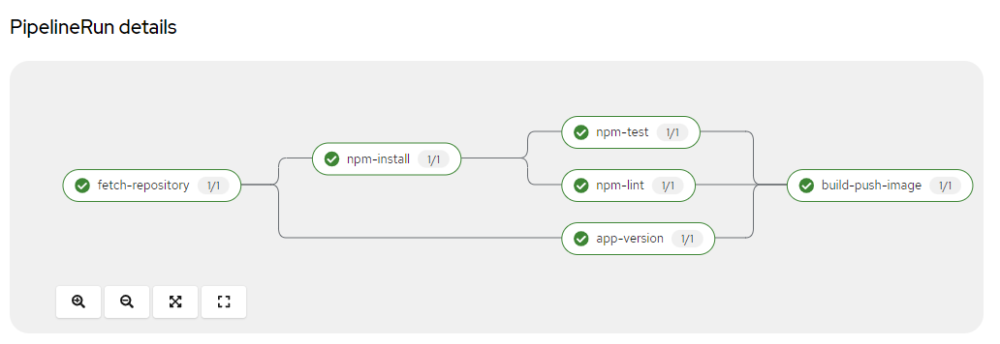

---

# Continues Delivery of Node.js App using Openshift pipelines and Tekton CI/CD

## Overview

This project demonstrates the automated Continues Integration, Continues delivery of a Node.js application on RedHat Openshift using openshift pipelines. It's a great starter project for those practicing devops on openshift.
  
  


## Technologies Used

- Openshift Pipelines
- [Tekton CI/CD](https://tekton.dev/)
- [buildah](https://buildah.io/)
- [Quay Image Registry](https://quay.io/)

## Basic requirements

1. Redhat Developer Account

    - [Create developer account](https://developers.redhat.com/register)
    - Navigate to [Redhat Developer Sandbox](https://console.redhat.com/openshift/sandbox) and Launch Redhat Openshift Cluster
     

2. Quay Image Registry Account

    - [Create a Quay registry account](https://quay.io/repository/)


## Installation

1. Clone this repository to your local machine:

     ```bash
     git clone https://github.com/mAbdelfatah11/DO288-apps.git
     ```

    - check the application code at the following path:
  
      ```bash
      apps/pipelines-creation/exchange
      ```

2. Install openshift cli 'oc' to your local environment, installation package available at the developer account web console, like the following:

     

3. Authenticate to openshift cluster api:
   
     - get the login command from the web console:
       

     - login command is similar to the following:
   
         ```bash
         oc login --token=sha256~MecXitlCPd --server=https://api.sandbox.p1.openshiftapps.com:6443
         ```
4. Install tekton cli "tkn" with the same installation process like "oc" cli from the cluster web console:


## Usage

1. Edit the required parameters at the manifests files:
   
   - (mandatroy) In pipeline.yaml file, edit the "build-image" params section with your "Quay user" in the parameter called "IMAGE"

2. create npm custom task:

   ```bash
   oc apply -f npm-task.yaml
   ```

2. create pipeline resources:

   ```bash
   oc apply -f pipeline.yaml
   ```
3. start pipeline using command line:

   ```bash
   tkn p start nodejs-build -w name=shared,volumeClaimTemplateFile=volume-template.yaml
   ```

4. Interactivly watch the pipeline tasks in thier progress to build and push the final image to the quay registry at repository name called 'exchange'
    
     

     
